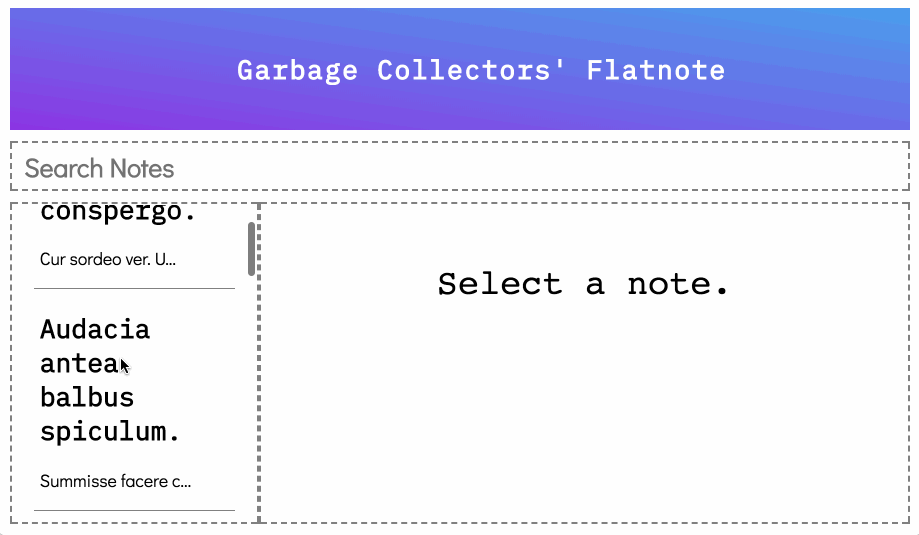
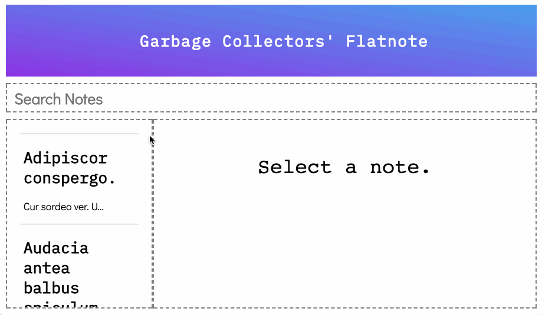
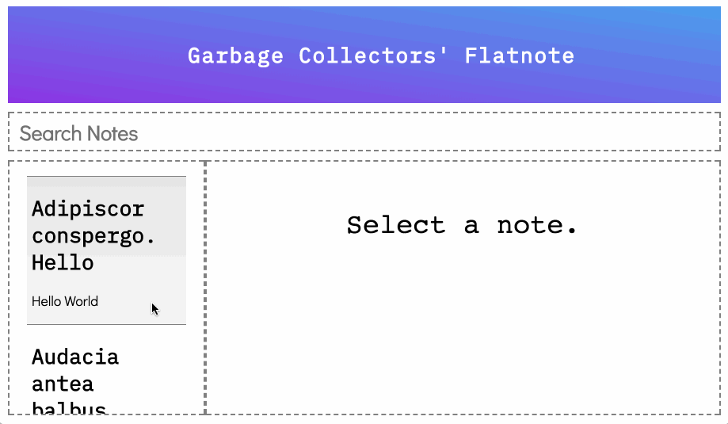
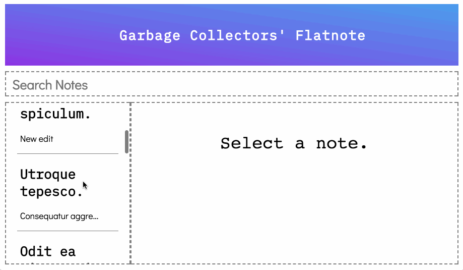

README: React Guided Project
======================

This is the starter code for a Mod 4 guided project. It is generic enough so that you can build out the domain of your choice! However, there are some restrictions in place.
* You will build on top of the existing Rails backend and the React front end starter code
* You will have exactly two models, one of which must be `User`
* You must have a has-many relationship where the `User` has many of the other model
* The other model must belongs to a single `User`

For example, your project can be a `User` has many `Dogs`, a `User` has many `Recipes`, or a `User` has many `Notes`. Your goal will be to read, create, update, your belongs to model. You will also complete some other baseline deliverables and then make this project your own by building out unique stretch goals. Some suggestions are listed below, but try to be creative!

## Requirements
- [ ] Complete all of the *Deliverables*.
- [ ] Build out at least 1 stretch goal feature.

## Setup

The codebase is split up into a Rails API backend and a React frontend. Everything is contained in this single repository. Your Rails code is located inside of the `backend` folder and your React code is located inside of the `frontend` folder.

Each of those folders has a README file with setup instructions. For conciseness, those instructions are copy pasted here:

### Frontend

```sh
# from within this directory:
npm install
PORT=4000 npm start
```

This React app will be running on `http://localhost:4000`.

### Backend

```sh
# from within this directory:
bundle install
rails db:create db:migrate db:seed
rails s
```

Your Rails backend API will be running on `http://localhost:3000`.

#### User ID

The seed file should create one user for you, so your default user should be `id: 1`. If that doesn't work, debug it with the `/api/v1/users` route as shown below.

#### Routes

| Method | Route               | Headers                                                              | Body                 |
| ------ | ------------------- |:--------------------------------------------------------------------:|:--------------------:|
| GET    | `/api/v1/users`     |                                                                      |                      |

**Tips:**

* Test out your routes with [Postman](https://www.getpostman.com/) to see how they work and what they return.
* Look at the source code! Check out `/app/controllers/api/v1/users_controller.rb`! There are many more routes that are not listed that may make your life easier. Use those development skills and hack the code!

## Provided Code

**Backend**

Let's assume your models are a `User` has many `Items`

* The `User` has been built out for you, but not it's relationship.
* You will need to create the model AND its relationship with `User`, the migration file, the routes, and the controller for `Item`.
* You should migrate your database and seed it with `Item` data. All `Items` should belong to `user_id` 1.
* You will need to build out the functionality and routes to GET, POST, and PATCH to your `Item`.
* You should build out a serializer so that a GET call to `http://localhost:3000/api/v1/users/1` should have the `Items` data nested inside the user object. See the example below where a `User` has many `Notes`:


**Frontend**

* All CSS styles are provided for you. But you may want to edit `src/assets/css/brooke.css` to change the styling.
* Many components are provided for you, but most are not completely functional. It is your job to read the code and figure out how to incorporate it into your app.

## Deliverables

Look at the gif below to see how the app should look and behave. The example gifs use the models `User` has many `Notes`. These are the baseline deliverables you need to complete:

**Viewing and Displaying Items**

- [ ] Display all items in the left sidebar.
- [ ] Displayed sidebar items should show one or two pieces attributes of the item, but not all of its information.
- [ ] When clicking an item from the sidebar, display all its contents in the right panel.



**Editing Item**

- [ ] When displaying an item in the right panel, show an `Edit` button.
- [ ] Clicking the `Edit` button will allow the user to edit the item's information in the right panel.
- [ ] When in edit mode, also show a `Save` button which saves the item via a `PATCH` request.
- [ ] When in edit mode, also show a `Cancel` button which discards any changes and reverts back to displaying the original item.
- [ ] Clicking a different item while in edit mode should discard your changes and display the new item instead.



**Creating Items**

- [ ] At the bottom of your left sidebar, show a `New` button.
- [ ] Clicking `New` will create a new item via `POST` request.
- [ ] This new item should appear in the sidebar.



**Filtering Items**

- [ ] Implement the filter to search through your items.



## Stretch Goals

When you are finished with the *Delieverables*, you can build out any new features that you want. This is your chance to be creative and make your project unique!

Some suggestions:

- Sorting by date created, date edited, alphabetical, etc.
- Use `react-router` to create a multi-page app
- User signup & login
- Sharing items with other users
- Rich text formatting
- Tagging
